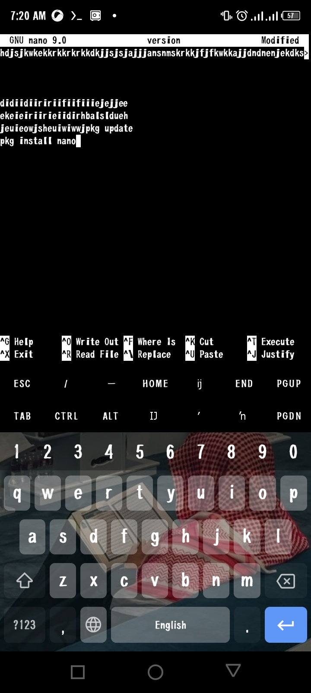
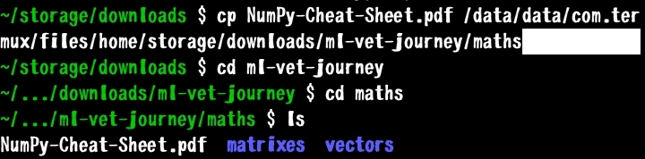

Date : 31|05|26

1. Nano environment


2. Copying files with cp filename filedestination_path and coo 

3. Files, Data Blocks & Storage

Plain Text & Data Blocks
- **Data Block 1201**  
  Example block:
  +------------------+
Hello this is
my note.
  +------------------+
- Internally, characters are stored as **bytes**, and bytes are represented as `0s` and `1s`.

File Structure
`File-name` → `Notes.txt` → `Inode 48291` → `Blocks 1201, 1202, 1203` → Binary data: `01000 01100101 01100 ...`

What is a Data Block?
- A **sequential series of storage addresses**.
- Default size in **EXT4 Filesystem**: `4K` (4 Kilobytes).
- To view raw data blocks, use the `hexdump` utility.

Terminal Filename Conventions
1. Use type extensions: `.txt`, `.jpg`, etc.
2. No spaces. Use:
   - Underscore: `my_file.txt`
   - Backslash + space: `my\ file.txt`
   - Backslash before any special character.

---

2. Creating & Editing Files

Commands
1. **`touch` Command**: Create empty files.
   ```bash
   touch Notes.txt
2. *`nano`*: Text editor in Linux.

Buffers vs Files
- `nano` uses buffers = the text being edited.
- Buffers may be loaded from a file or saved to a file.
- *Note*: If you don’t tell `nano` to save, it won’t. It will ask on exit.
- Cut buffer: `Ctrl + K` | Uncut buffer: `Ctrl + U`

---

3. Copying, Moving & Deleting Files

Copying Files - `cp`
*Syntax:*
cp text.txt textCopy.txt
Copy a file into a directory:
cp textCopy.txt downloads
Copy a directory recursively:
cp -r Music test_directory
Moving/Renaming Files - `mv`
Move a file up one level:
mv test1 ..
Rename a file:
mv test1 renamedTest1
Deleting Files - `rm` & Wildcards
*Basic delete:*
rm filename
*Wildcards:*
- `*` = matches all strings/text
  ls *.txt
  rm *.txt
*`rm` Flags:*
- `-r`: Recursively delete directories
  rm -r Musics
- `-rf`: Recursively delete, force, don’t stop on errors
  rm -rf Musics
---

4. Viewing Files

`cat`
- Displays file contents.
- Can show multiple files in sequence:
  cat test.txt testCopy.txt
- `-vET` flag shows non-printing characters:
  cat -vET test.txt
- `cat` has many flags.

`more`
- Displays file content page by page:
  more filename
---

5. Standard Streams, Pipes & Redirects

Standard Files
Every Linux process has 3 default I/O streams:
1. *Standard Input (stdin)*: File descriptor `0`  
   Purpose: Source of input data. Default: Keyboard.
   Example: `cat` reads text from stdin if no filename given.
2. *Standard Output (stdout)*: File descriptor `1`  
   Purpose: Destination for normal program output. Default: Terminal Screen.  
   Example: `ls` sends list of files to stdout.
3. *Standard Error (stderr)*: File descriptor `2`  
   Purpose: Destination for error/diagnostic messages. Default: Terminal Screen, separate from stdout.  
   Example: `ls nonexistent` sends “No Such File” to stderr.  
   Keeping stdout and stderr separate lets you capture results without mixing errors.

Pipes `|`
A pipe connects the *stdout* of one command directly to the *stdin* of another. Data flows one direction only.

*Example 1:*
echo "apple banana apple" | wc -w
1. `echo` outputs: `apple banana apple`
2. `|` grabs stdout before it hits the screen
3. `wc -w` receives it and counts words → prints `3`

*Example 2:*
ls | head -5
1. `ls` makes a list of files
2. `|` feeds that list to `head`
3. `head -5` shows only first 5 lines

Redirects
Redirects send output to a file instead of another command.

1. *`>` Overwrite redirect*: Sends stdout to a file. Overwrites if file exists.
   echo "hello" > notes.txt
   Result: `notes.txt` now contains “hello”, old content gone.

2. *`>>` Append redirect*: Adds stdout to end of file.
   echo "world" >> notes.txt
3. *`<` Input redirect*: Feeds a file into a command’s stdin instead of keyboard.
   command < input.txt
4. *`2>` Error redirect*: Sends stderr to a file.
   ls missing 2> error.txt
   Result: Normal `ls` output still prints to screen, error message goes into `error.txt`.

---

6. Grep, Sed & Regex

`grep` - Global Regular Expression Print
Searches through text and prints lines that match a pattern.

*Basic use:*
grep "error" logfile.txt
Means: read `logfile.txt`, print only lines containing “error”.

*With a pipe:*
ls | grep ".txt"
`ls` lists files, `grep` filters to show only lines with “.txt”.

Regex - Search Patterns
- Normal `grep` uses standard regex.
- *Note*: Some regex characters have special meaning to `bash`, so quote your patterns.

*Grep Input Flags:*
- `-E`: Use extended Regex
- `-F`: Treat pattern as fixed string, don’t use Regex

*Regex in `nano`*: `Ctrl + \` to edit and activate Regex search.

`sed`
Not fully detailed in notes, but often used with `grep` for stream editing.

--------------------------

