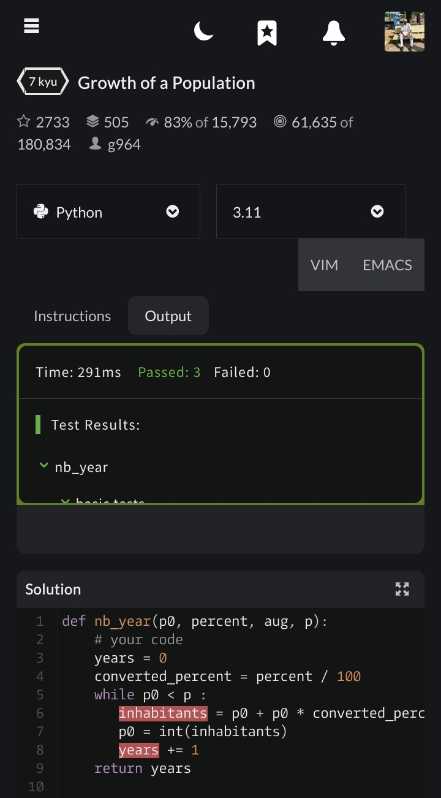
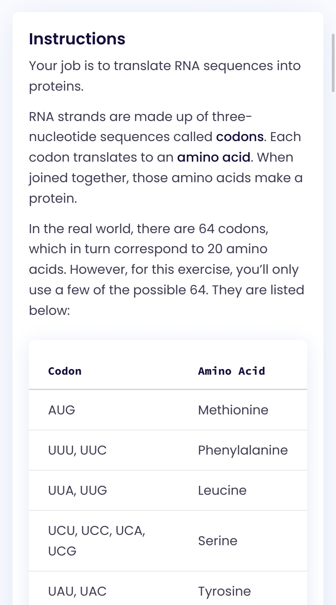
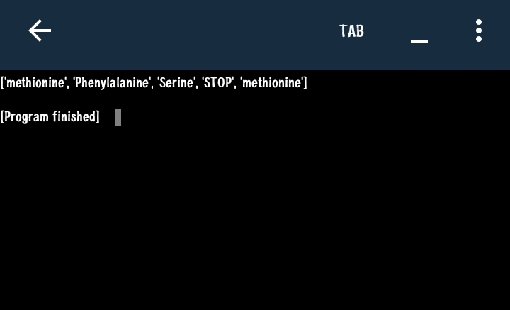

After learning python while I was studying machine learning. I felt no need to go over and start again for backend engineering journey which made me come to a decision of solving challenges for 2 weeks to refresh my memory and stay on tract in my python skills sets.
I choose to so do this challenge with codewars and exercism.
Started: 1st July 2026 after completing Linux basics.

Day01 : 1st June 2026
1. Descending challenge — codewars

2. Growth population challenge — codewar

Day 02 : 2nd june 2026
3. Protein Translation – Exercism

Note: This tests my knowledge on loops, if else statements and lists.
