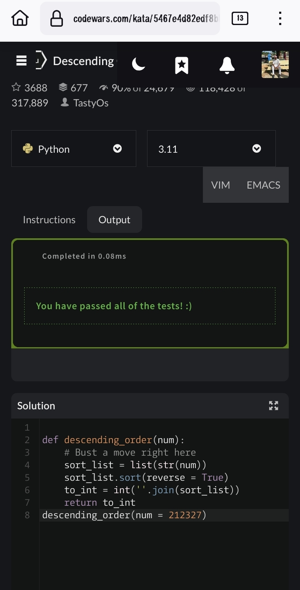
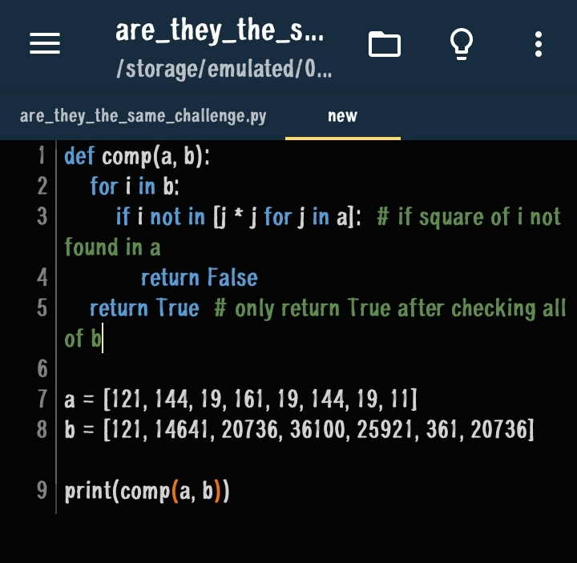
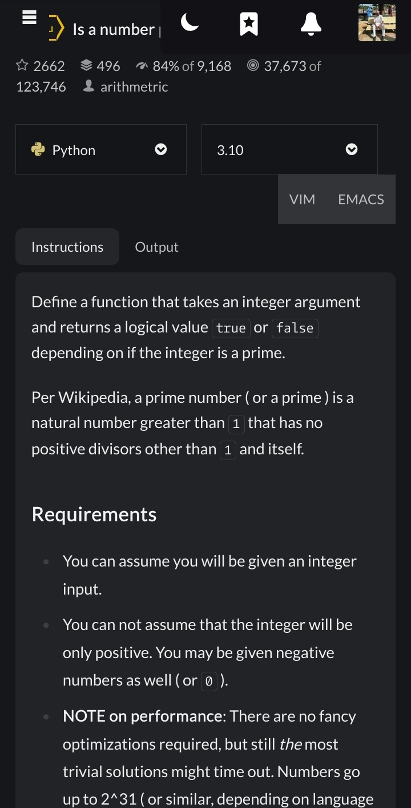
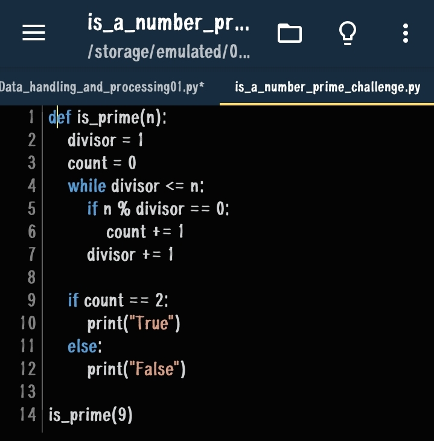
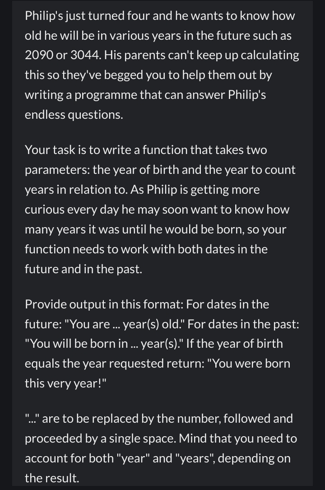
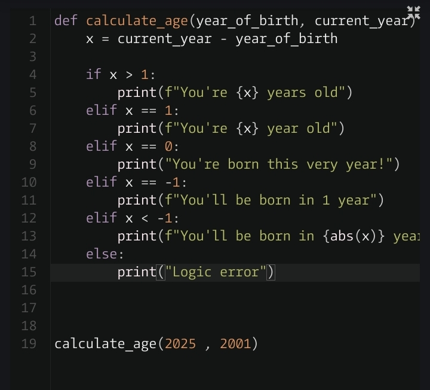
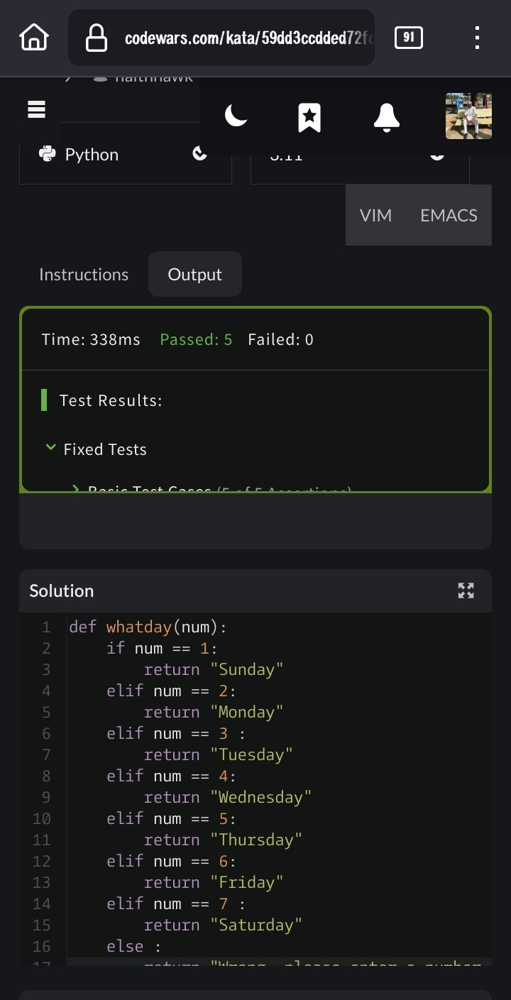
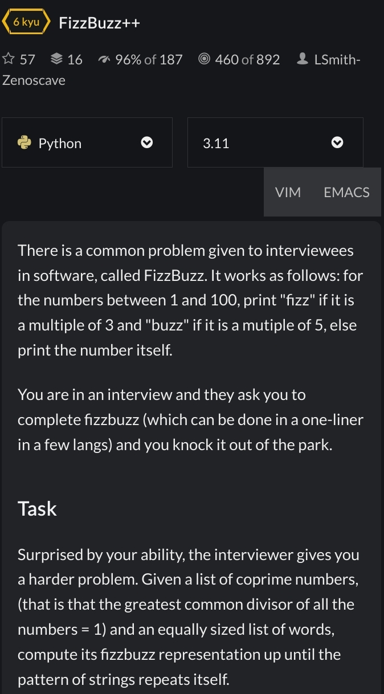
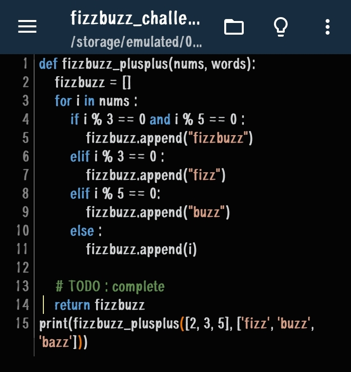

After learning python while I was studying machine learning. I felt no need to go over and start again for backend engineering journey which made me come to a decision of solving challenges for 2 weeks to refresh my memory and stay on tract in my python skills sets.
I choose to so do this challenge with codewars and exercism.
Started: 1st July 2026 after completing Linux basics 

1. Descending challenge — codewars

2. Growth population challenge — codewar

3. Protein Translation – Exercism

Note: This tests my knowledge on loops, if else statements and lists.

4. Are they the same challenge - codewars

This checks if array in b are square root or those in a.

5. Is a number prime challenge

6. How old will I be in 2099 challenge

7. Return the day challenge
 
8. Fizzbuzz++  Challenge

Challenge ends June 30, 2026 🥳