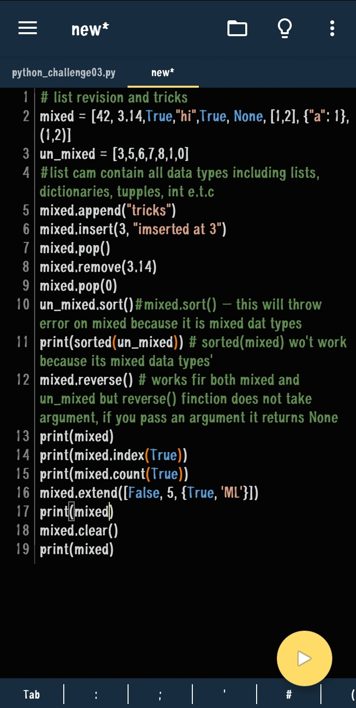
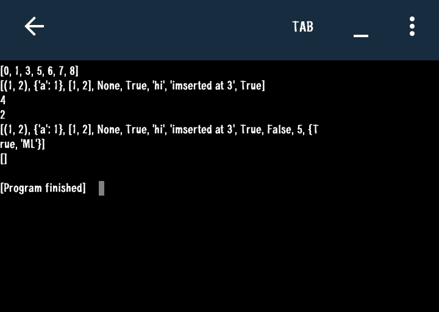
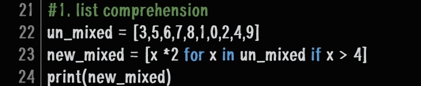
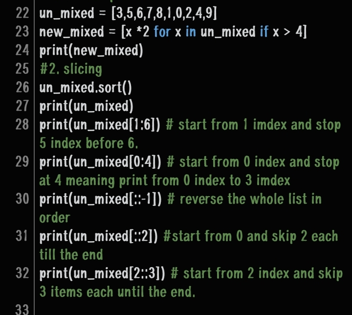
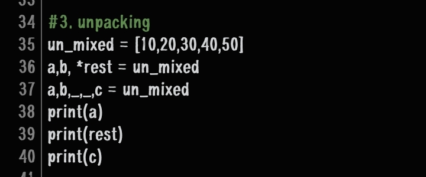
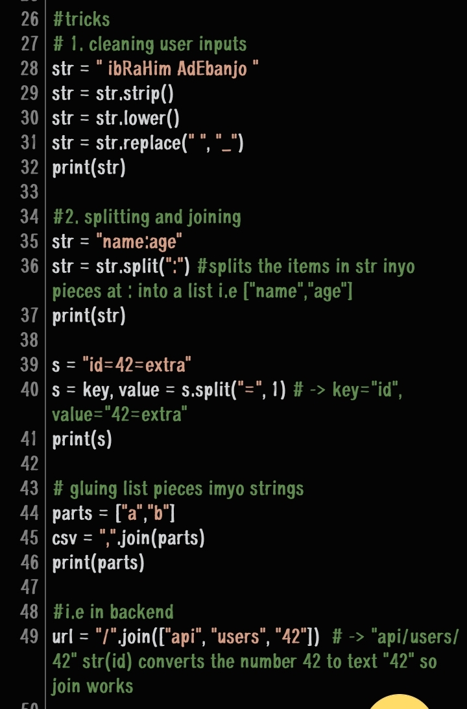
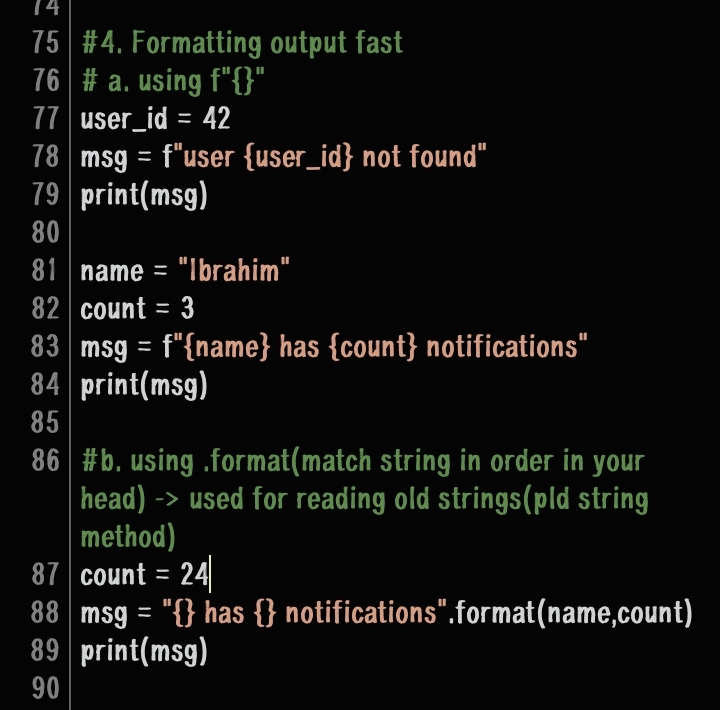
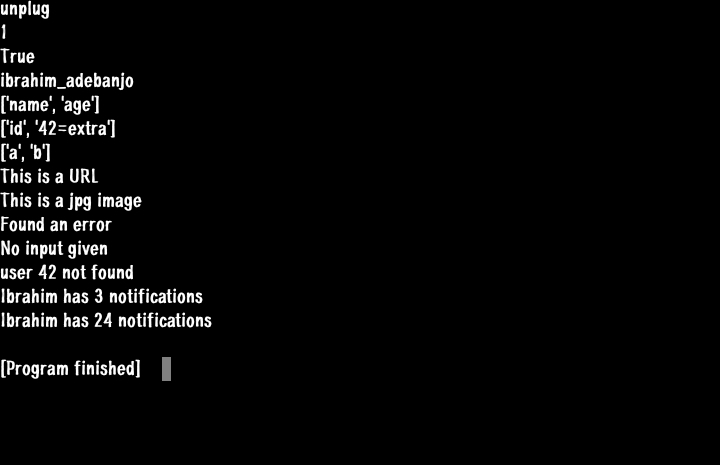
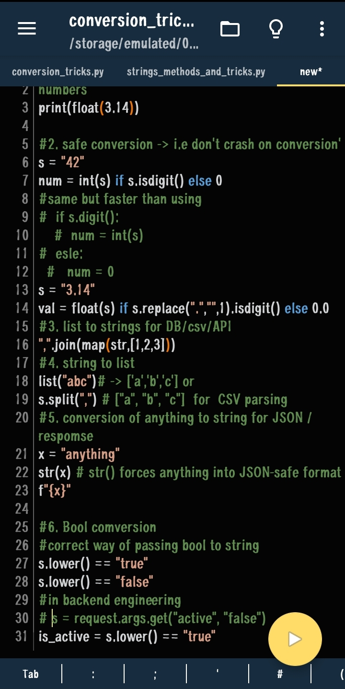
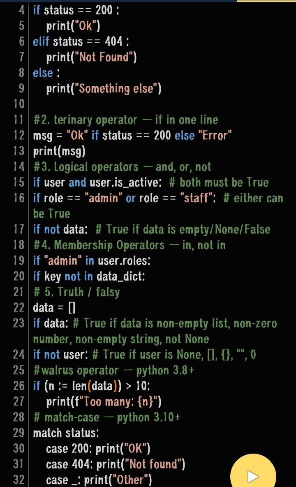

The goal here is to focus on weak spots where I'll have like a summary of all important key aspect in python mastering including tricks that will help me better in future challenges.

1. Lists 
Lists are basically collection of data types orderly arranged  which can be changed or manipulated or emptied. 
Syntax:
`list = [1,5,4,0]`

A. Methods 
 `lst.append(x)        # add to end
lst.insert(i, x)     # add at index i
lst.pop()            # remove and return last item
lst.pop(i)           # remove and return item at i
lst.remove(x)        # remove first x
lst.sort()           # sort in place
sorted(lst)          # return new sorted list
lst.reverse()        # reverse in place
lst.index(x)         # find index of x
lst.count(x)         # how many x in list
lst.extend([a,b])    # add multiple items
lst.clear()          # empty the list`

B. Result 

C. Tricks
i. List comprehension
This is a trick used to create a new list from an existing lost without typing for loop.
I.e `list = [10,20,30,40,50]`
syntax : 
`new_list = [ x * 2 for x in [10,20,30,40,50] if x > 20 ]`
`[expression for item in iterable if condition] `

This is done instead of using a for loop directly i.e 

`new_list = []
for x in [10, 20, 30]:
    if x > 15:
        new_list.append(x * 2)
 new_list is now [40, 60] `

ii. Slicing
This is a way of pulling out a chunk or pieces or portion of a list, string or tupple by just specifying start, stop and step positions.

Syntax: 
`list = [1,2,3,4,5]`
`new_list = [start:stop:step]`
- `start`: index to begin at
- `stop`: index to stop before  
- `step`: how many items to skip each time
I.e 
- `lst[1:4]   # [1,2,3] - from index 1 up to but not including 4`
- `lst[::-1]  # [5,4,3,2,1,0] - reverse the whole list`
- `lst[::2]   # [0,2,4] - every 2nd item`
- `lst[:-1]   # [0,1,2,3,4] - everything except last item` 

iii. Unpacking
This trick pulls stuffs or individual items out from lists and assign it to a named variables.
Syntax: 
`list = [1,2,3,7]`
`a,b, * rest = list` `result a = 1, b = 2 rest = [3,7]`
`a,b,_,_,c = list ` `result c = 7`

Usage: save you, when you want to loop through pairs in a list.
`for name, score in [("Ali", 90), ("Sara", 85)]:
    `print(name, score) `
 

NOTE: 
The variables must be equal to the amount of items in the list unless using asterisks (*) or replacing it with underscore (_).

iv. Membership trick
This is used to check if an item is in a list without using loops.
Syntax: 
`if "python" in languages:
    print("Found it")`
    Rather than using a loop.
    I.e
    `found = False
for x in lst:
    if x == "python":
        found = True`

2. Strings and it's tricks 
 

3. Conversion tricks 

4. Statements and operators tricks 

Done 🥳✨
Continuing python challenge tomorrow.
Completed  : June 14 2026